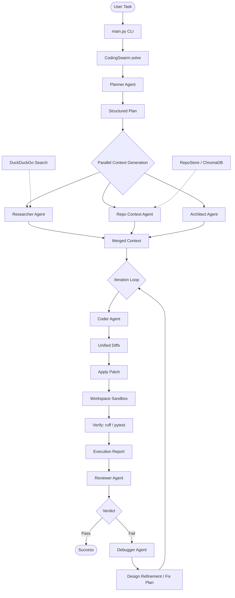

# KaggleCoder Swarm

KaggleCoder Swarm is an autonomous, multi-agent development framework designed to locate, edit, lint, and test code dynamically. It coordinates a team of specialized local language model agents to perform software engineering tasks. The framework probes the available system hardware to select the optimal inference backend, indexes repositories using tree-sitter syntax-aware chunking, and executes iterative self-correction loops to solve complex tasks.

## Key Features

* **Hardware-Aware Backend Selector**: Automatically probes system resources to run models via vLLM, Hugging Face Transformers, or Llama.cpp based on the available VRAM and CUDA capability.
* **AST-Aware Repository Chunking**: Uses tree-sitter to parse code into abstract syntax tree nodes for higher-quality semantic retrieval (RAG) rather than using arbitrary character chunk boundaries.
* **Parallel Context Gathering**: Resolves tasks faster by generating implementation plans, executing external research, retrieving code snippets, and drawing module boundaries in parallel.
* **Iterative Self-Correction**: Implements a code-verify-debug loop where linter errors and test failures are fed back to a debugger agent to generate incremental code patches.
* **SQLite Session Logging**: Persists every agent prompt, response, and tool interaction in a structured database for reproducibility and auditing.

## Architecture and Workflow

The framework employs a hub-and-spoke execution flow coordinated by a centralized coding swarm.



### Agent Roles and Responsibilities

The swarm contains several specialized agent roles, each defined by a specific system prompt:

1. **Planner**: Creates a step-by-step roadmap of files to inspect and defines acceptance criteria before code changes are made.
2. **Researcher**: Searches external documentation using DuckDuckGo to gather current library behaviors and specifications.
3. **Repo Context**: Summarizes relevant files and key code symbols returned from the Chroma vector store.
4. **Architect**: Designs module boundaries, data flows, interfaces, and identifies implementation risks.
5. **Coder**: Focuses entirely on implementing changes, outputting them strictly as unified diffs.
6. **Reviewer**: Evaluates applied changes against test suite runs and syntax linters to issue a pass or fail verdict.
7. **Debugger**: Diagnoses test failures and stack traces, formulating patch plans for the next coder run.

---

## Directory Structure

```
├── agents/             # Agent definitions (Planner, Coder, Architect, etc.)
│   ├── base.py         # Base agent logic and JSON repair capabilities
│   └── ...
├── benchmarks/         # Performance evaluation suites
├── config/             # Prompts and workspace settings
├── execution/          # Swarm control loops and coordination
│   ├── swarm.py        # Centralized solve coordination loop
│   └── orchestrator.py # Swarm execution stubs
├── memory/             # Session storage and database loggers
├── models/             # Local inference backends (vLLM, Hugging Face, Llama.cpp)
│   ├── backend_selector.py # Auto-selects model based on hardware characteristics
│   └── gpu_probe.py    # Queries local CUDA device specifications
├── rag/                # Syntax-aware repository indexing and store
├── tools/              # Unified patches, shell runners, search tools, and linters
├── ui/                 # CLI entrypoint components
└── tests/              # Verification test suites
```

---

## Getting Started

### Prerequisites

* Python 3.10 or higher
* CUDA-capable GPU (optional, but recommended for fast inference)
* Git

### Installation

1. Clone this repository to your local directory:
   ```bash
   git clone <repository-url>
   cd kaggle-coder-swarm
   ```

2. Set up the virtual environment:
   ```bash
   uv venv
   source .venv/bin/activate  # On Windows: .venv\Scripts\activate
   uv pip install -r requirements.txt
   ```

3. Configure your environment variables. Copy `.env.example` to `.env` and set the required variables:
   ```bash
   KCS_ROOT=/path/to/data/directory
   ```

---

## Usage

### 1. Indexing a Repository
Before running tasks on a codebase, index it in the RAG vector store. This creates structural chunks and stores them in the local database:
```bash
python main.py index --repo /path/to/target/project
```

### 2. Solving a Task
To run the swarm on a task, provide the task description and optionally the repository path:
```bash
python main.py solve "Add a database validation to check for duplicate email registrations" --repo /path/to/target/project
```

You can also force a specific execution tier using the `--tier` or `-t` flag:
```bash
# Force the lightweight CPU fallback tier (Tier 3) to run on a non-GPU instance
python main.py solve "Add a database validation..." --repo /path/to/target/project --tier 3
```

### 3. Displaying GPU Backend Information
You can verify which backend engine the framework has chosen for your hardware:
```bash
python main.py info
```

Or check the parameters of a forced tier choice:
```bash
python main.py info --tier 2
```

---

## Technical Details

### Hardware-based Backend Selection
The selector probes the system using `torch.cuda` and assigns the model backend as follows:
* **Ampere/Hopper GPUs (more than 70 GB total VRAM)**: Runs Qwen2.5-Coder-7B-Instruct in BF16 using **vLLM** with Tensor Parallelism enabled.
* **Turing GPUs (such as T4 or RTX 20xx with more than 28 GB total VRAM)**: Runs Qwen2.5-Coder-7B-Instruct (AWQ quantized) via **Hugging Face Transformers** and Accelerate device placement.
* **Low VRAM / Standard GPUs**: Runs Qwen2.5-Coder-3B-Instruct in 4-bit quantization via Hugging Face.
* **CPU and Non-CUDA systems**: Falls back to Qwen2.5-Coder-1.5B-Instruct-GGUF using **Llama.cpp**.

### Syntax-Aware Chunking
Instead of splitting text using arbitrary character limits, the retrieval pipeline parses supported programming languages (such as Python, JavaScript, TypeScript, Go, Rust, Java, C, and C++) using tree-sitter. This groups complete semantic blocks (classes, functions, decorators) together, ensuring the RAG model receives functional code structures instead of fragmented lines.
